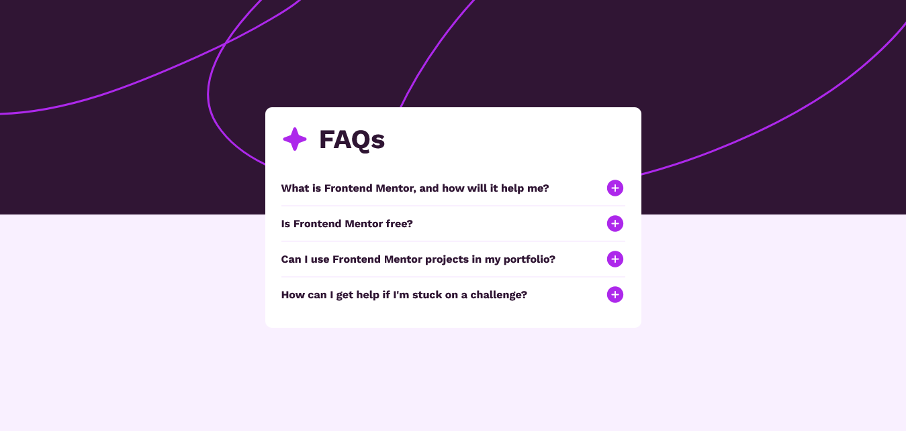

# Frontend Mentor - FAQ accordion solution

This is a solution to the [FAQ accordion challenge on Frontend Mentor](https://www.frontendmentor.io/challenges/faq-accordion-wyfFdeBwBz). Frontend Mentor challenges help you improve your coding skills by building realistic projects. 

## Table of contents

- [Overview](#overview)
  - [The challenge](#the-challenge)
  - [Screenshot](#screenshot)
  - [Links](#links)
- [My process](#my-process)
  - [Built with](#built-with)
  - [What I learned](#what-i-learned)
  - [Useful resources](#useful-resources)
- [Author](#author)
- [Acknowledgments](#acknowledgments)

## Overview

### The challenge

Users should be able to:

- Hide/Show the answer to a question when the question is clicked
- Navigate the questions and hide/show answers using keyboard navigation alone
- View the optimal layout for the interface depending on their device's screen size
- See hover and focus states for all interactive elements on the page

### Screenshot

### Links

- Solution URL: 
- Live Site URL: [https://lucasngtg.github.io/faq-accordion/](https://lucasngtg.github.io/faq-accordion/)

## My process

### Built with

- Semantic HTML5 markup
- CSS custom properties
- Flexbox
- CSS Grid
- Mobile-first workflow
- [React](https://reactjs.org/) - JS library

### What I learned

React is great for creating modular components without clogging the HTML with repeated elements, though I do not understand why the index.html can only access files in the public folder. 

### Useful resources

- [React Tutorial For Beginners](https://www.youtube.com/watch?v=dGcsHMXbSOA)
- [The simple trick to transition from height 0 to auto with CSS](https://www.youtube.com/watch?v=B_n4YONte5A)

## Author

- Frontend Mentor - [@LucasNgTg](https://www.frontendmentor.io/profile/LucasNgTg)
- GitHub - [@LucasNgTg](https://https://github.com/LucasNgTg)
